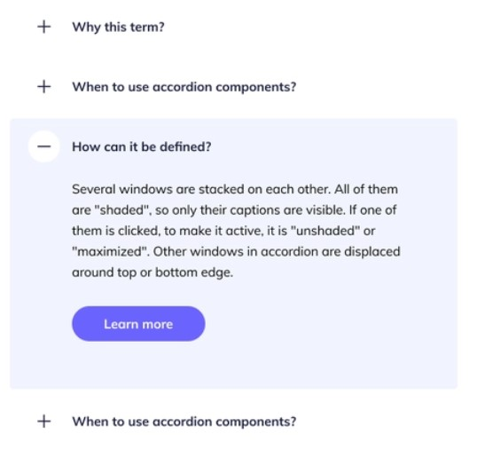
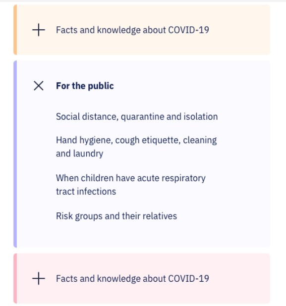

**FAQ Section**

Design Ideas:
- Minimalist:

- With Colors:

Content:

1. What is E.Motion?
We are Cornell’s K-Pop dance group! We teach members of all levels and hold workshops, make socials, and perform for the Cornell community. Outside of that, we also film covers to go online!

2. Do I have to audition to join?
No auditions are required to join E.Motion! You can participate and perform in group dance. The only auditions are to join a performance team or fast cover.

3. How can I participate?
You can join Beginner/Group Dance, PT, or Fast Cover, or attend a workshop (announced on weekly basis).

4. What's Beginner/Group Dance?
- No cut -- just come to practice every week!
- Allow you to perform alongside normal PTs
- Are slower paced and break down the moves in more detail

5. What's a PT? CL? Season?
PT: Performance Team
CL: Choreo Leader
Season: A round of dances; each season has 3-4 dances (synonymously used with ‘round’)
Each semester usually has 1-2 seasons.

6. What's the PT selection process?
1. Songs are suggested: At the beginning of each season, every CL submits to E.Board three songs they are willing to teach as PTs.
2. Voting Period: We send out a voting form to all members.
3. PTs are determined: The PTs for the season are determined by E.Board based on the top-voted songs, practice space, and CL availability.
This process repeats every season!

7. How do I get into a PT?
1. Go to workshop
  - First  practice will act as a workshop and we will  teach you the chorus of the song. Either go just for fun or to try out for the PT!

2. Allow yourself to be filmed
  - This is so choreo leaders can see how much you’ve learned or improved on so that they can judge whether you fit the song!

3. Wait for the results
  - If you get in and are sure that you can make all the practices (or give before notice if a day is impossible), accept!

NOTE: Each person  is limited to a maximum of 2 PTs per ‘season’. This includes being backup in a PT as well.

8. What makes PT different?
- More responsibility
- Mandatory Practices
- Being on-time for events
- Ability to practice by themselves

9. How do Fast Covers work?
1. A CL holds a workshop/auditions
2. Chosen members practice together for a week
3. Film!

10. What makes Fast Covers different?
- Finish at a faster pace (usually one week)
- High time commitment
- Workshops/auditions are available for everyone!

-----------------------------------
**Newsletter section**

Wants to join our listserv? Email us at cornellemotion@gmail.com!
