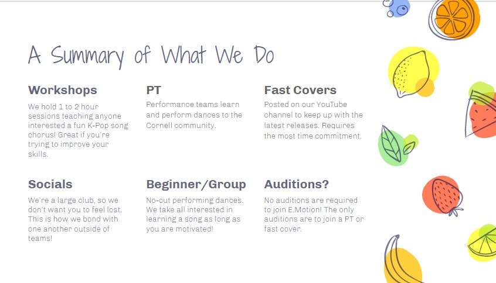

Upcoming Events:
- Spring Showcase:
  -  SAT 5/7 @ WSH Theatre (aka Cornell Cinema)
  - Tickets $5
  

Past Events:
- Hope Night
  (can download the images from it)

Link to youtube for videos:

Workshops
We hold 1 to 2 hour sessions teaching anyone interested a fun K-Pop song chorus! Great if you’re trying to improve your skills.

PT
Performance teams learn and perform dances to the Cornell community.

Fast Covers
Posted on our YouTube channel to keep up with the latest releases. Requires the most time commitment.

Socials
We’re a large club, so we don’t want you to feel lost. This is how we bond with one another outside of teams!

Beginner/Group
No-cut performing dances. We take all interested in learning a song as long as you are motivated!

Auditions?
No auditions are required to join E.Motion! The only auditions are to join a PT or fast cover.
