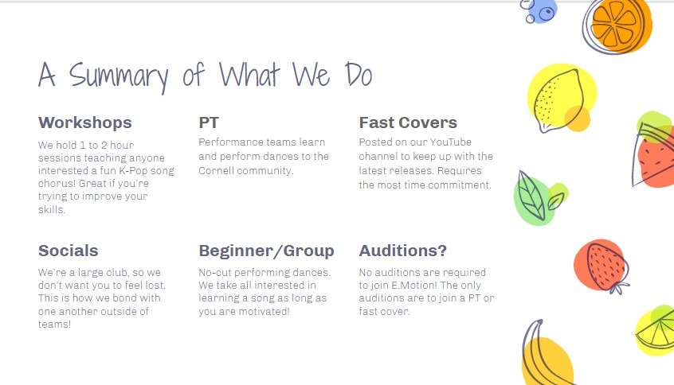

**Upcoming Events section**
- Spring Showcase:
  -  SAT 5/7 @ WSH Theatre (aka Cornell Cinema)
  - Tickets $5
  - Are you ready to BOP TO THE TOP? HIGH SCHOOL E.MOTION: THE MUSICAL: THE SHOWCASE is happening on Saturday, May 7, 7-9 PM in Cornell Cinema. Follow Chad as he struggles to figure out if he should STICK TO THE STATUS QUO or GO HIS OWN WAY? Get your tickets today! It’s gonna be A NIGHT TO REMEMBER, so don’t miss out!
  

--------------------------------------
**Videos Section**

Gallery of video covers?

Link to youtube for videos: https://www.youtube.com/c/EmotionCornell/featured

---------------------------------------
**What We Do section**

Idea of how to layout this section (from their interest meeting slideshow):

Workshops
We hold 1 to 2 hour sessions teaching anyone interested a fun K-Pop song chorus! Great if you’re trying to improve your skills.

PT
Performance teams learn and perform dances to the Cornell community.

Fast Covers
Posted on our YouTube channel to keep up with the latest releases. Requires the most time commitment.

Socials
We’re a large club, so we don’t want you to feel lost. This is how we bond with one another outside of teams!

Beginner/Group
No-cut performing dances. We take all interested in learning a song as long as you are motivated!

Auditions?
No auditions are required to join E.Motion! The only auditions are to join a PT or fast cover.
