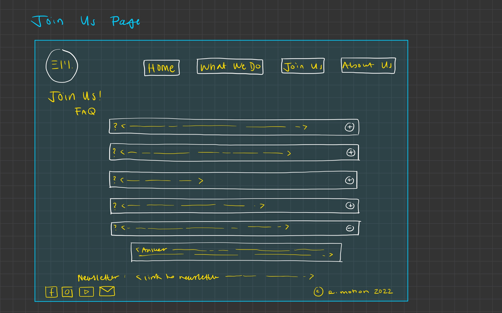

# Group Project: Design Journey

**You are encouraged to work ahead on everything on this project.** (Though we suggest you hold back on the interactivity until Project 3.) **Each section is required for a specific milestone. You are required to have these sections completed before that milestone's deadline.**

**Replace ALL _TODOs_ with your work.** (There should be no TODOs in the final submission.)

**Be clear and concise in your writing.** Bullets points are encouraged.

**Everything, including images, must be visible in Markdown Preview.** If it's not visible in Markdown Preview, then we won't grade it. We won't give you partial credit either. This is your warning.


# Client (Milestone 1)

## Client Questionnaire (Milestone 1)

1. Describe your organization and its purpose.

    E.Motion is Cornell's only K-Pop dance group. Their purpose is to create an open environment for people to teach and learn actual K-Pop dances. They do dance covers, have live performances, and hold showcases. They film their performances and post those recordings to their social media (Instagram and Facebook) and YouTube channel. They have showcases every semester as an opportunity for their members to show off what they learned throughout the semester.

2. What makes your organization and its services different or unique?

    Compared to other dance troupes at Cornell, E.motion is completely open to all levels of dancers, even if it is their first time dancing. They focus on being inclusive to dancers at all stages, from absolute beginners to experienced dancers. Also, unlike other dance clubs that might be hip-hop-based or contemporary, their genre is KPop, which is uncommon at Cornell.

3. Why are you looking for a new website?

    They would look for a website because E.Motion has a YouTube and two social media accounts, but not a website. This is a struggle because when they get a lot of outreach from sponsors or other dance groups at Cornell (or from other schools) for making an event or collaborating, all of their information and content is scattered. It would be nice to have one consolidated place for them to get E.Motion's information. It would also solidify their brand and let them customize their website's look, whereas on their social medias, they don't have that kind of control on the appearance. Moreover, it would give them a space on the web that would be more convenient to direct people to it.

4. What are your goals for this site and what kind of information about E.Motion do you want to share through it?

    For the website, they want to share E.Motion's history on how it started and also share about their team members and everyone who is part of it. They also want to share events they hold because they have a lot of workshops and other events happening constantly. It would be nice to have one place to display the times for all of their workshops, rehearsals, etc. because it gets messy very quickly. Having it link to their Google Calendar or making their Google Calendar more accessible would be nice. Also linking all of their social media accounts and YouTube video database is important for their users to find. A photo gallery of past events and team photos is something collaborators/sponsors ask to see.

5. Is there a "feel" that you want for your site? Are there colors or imagery that you have in mind?

    To preface, E.Motion has gone through a lot of inconsistent branding through the years, starting with pink and blue theme. Later it was just white, red, and blue (which are the Korean flag colors), and they mostly did whatever they wanted. This semester, they're just going with whatever color scheme.
    For their website, however, the color scheme should be reds, blues, and whites that reflect the flag of Korea. In those colors, the shades used in the website can be pastel shades.

    Her overall goal for the site is to convey is a welcoming vibe and make an open atmosphere. She doesn't want to be intimidating to new people and wants everyone to freely express their interest in KPop and not be nervous to dance. They want to incorporate that this genre's niche/quirkiness into the design as well. The feel might be messy, but the goal is to convey their club's happy vibes.

6. Who do you want to visit your site? Who is your site's target audience?

    Their target audience is two groups: people who are interested in working with E.Motion such as sponsors, other dance groups seeking to collab, etc. Their goal is for them to see the info they need all there instead of jumping between their social medias or being unaware of their other medias.
    The second target group is new people who are on the fence about dance and who might be intimidated to come to one of their workshops.

7. When visiting your site, what actions do you want your visitors to take?

    For the organizing with the collaborators and sponsors, E.Motion wants them to have access to their YouTube and social media accounts. The visitors might not know of all their other social medias or that their performances are posted in their YouTube. So, they want visitors to see all of their handles in one place and visit those for the videos or photos they might be looking for. Especially since they currently have to contact them directly to collect these resources.

    For newcomers, they want to show them, too, that there is the YouTube and Instagram and Facebook. They also want them to get the information on how the club works and how to join. They also want new people to sign up for their newsletter. They should also see the events and come to the events. Getting a feel of the club that convinces them to join the dance club or come to their events. They want these visitors to go on the website and see that the club is not as scary as a dance club at Cornell might seem. The visitor should see that it's a fun experience where everyone is there to have a good time and that there's no competition. The website should assure them that this is a space for them.

8. What are your three favorite competitors or similar organizations' sites? Why?
(If they cannot think of a specific site, we can ask them to direct us to a social media account that has a style/content that they like.)

    She is not really familiar with other dance troupes or other organizations at Cornell.

    She liked the club, Breakfree's promotion for their showcase. It seemed down to Earth and had similar vibes.

    Also Cornell Creatives is another organization who's website she liked. She thought the organization of their content was logical and showed who's part of the team and their community well. It did a good job of displaying what an organization's website should encapsulate.

## Client Description (Milestone 1)
> Tell us about your client. Who is your client?
> Explain why your client meets the client rules in the project requirements.

Our client is Cornell E.Motion. They are a K-Pop dance group that focuses on teaching people more about K-Pop dances by filming and posting their performances on social media where a lot of people can see it. Our clients meets the client rules because we are not the client, and there is no personal relationship with any of them. Another thing for why they fulfil our client requirements is that they do not have a website, which is something that can greatly help them reach more people who are interested.


## Client Website (Milestone 1)
> Tell us about the website that your client wants. Tell us the purpose of the website and what it is all about.
> NOTE: **If you are redesigning an existing website, give us the current URL and some screenshots of the current site.** (FireFox makes it easy to take a full screenshot of a page.) Tell us how you plan to update the site in a significant way that meets the project's requirements.

The client wants a website that is representation of them and what they do. The purpose the website is getting people to know more about their history, members and future events/ rehearsals on one place that is convenient. They would like to have their YouTube channel displayed on the website as well as their social media accounts so the users can reach out to them if they want or see the requirements for how to join the club. In addition, they want to include the background of their group and how it all started, which is something that will create a better connection between users and them and a gallery with their photos and videos for anyone to visually see how their group practices look.


## Client Website Scope (Milestone 1)
> Your project should be ambitious, but not too large. A good rule-of-thumb is that you should have about 1 content-full page for each team member.
> Explain why the website you will create for your client isn't too small and isn't too big. Explain why you think it's the right size for this project.

The website we will be creating for our client fits well within the scope of this project because it will be a static portfolio of E.Motion's past performances and history and planned future events. This makes our project not overly ambitious, because the client does not expect any forms, user-logins, search engines, nor any centralized storage. Specifically, the forms they plan to use are Google Forms they will provide us and their "video database" is their YouTube channel that stores all of their recordings.

Moreover, the project is ambitious enough, because the website will consist of 4 content-full pages, one for each team member. The content is static and the client has agreed to provide us with the content, so we will be able to focus on structuring and organizing their content rather than generating content ourselves. There are enough "categories" of information they seek to display on the site, as in their history, their planned events, how they work, etc. This will be enough for each team member to be able to contribute to the website equally and build a project that is ambitious, but not too large.


## Client Goals (Milestone 1)
> What kind of website do they want? What are their goals for the site?
> There is no required number of goals. You need as many goals as necessary to reflect your client's desires.

- Goal A: Friendly environment
- Goal B: Open to collaborate
- Goal C: Get their users to know them better
- Goal D: Organization of their future rehearsals/events


## First Client Meeting Minutes/Notes (Milestone 1)
> Include your notes/minutes from the client meeting.

Gabi is the design chair for E.Motion, she is a fine art major at Cornell AAP.

K-Pop dancing focus group, organizes a lot of workshops where they teach people how to dance to specific K-Pop dances. They like to film their covers and post them to social media. Host one showcase every semester. Have one coming up, an opportunity for all performers to perform all the pieces that they have learned throughout the whole school year.

Sharing K-pop by teaching people how to dance.

**What makes your service unique from others?**
Compared to other dance troupes, they are completely open to everyone. You don't have to be an experienced dancer to come to a practice. The user can be a total beginner. Sets them apart in terms of exclusivity. Other dance groups focused on stylistic dancing. E.Motion focuses on K-Pop dancing. They don't come up with own choreography .It is a very focused group.

We would like a new website because E.Motion has a YouTube channel and social media. Gets a lot of outreach from different sponsors and other dance groups (inside and outside Cornell). Organizing groups trying to make a group happen. Needs a single space where to gather all information. Having a website strengthens and solidifies a brand. Getting to brand a club 100%. Help E.Motion set their own space on the Internet. Easier to refer to a single website rather than multiple social medias.

**What kind of goals?**
For the website they would like to share brief history about how E.Motion got started. Wants a team page for E-board members who let the events function and happen. Would be nice to have an events page. A lot of workshops happening and it gets very messy sometimes. Consolidated page. Link to a Google calendar and add event feature.

Overall goal to convey is a welcoming vibe and happy atmosphere. Don't make people feel intimidated to come and hang out with us. Freely express interest in K-Pop and feel comfortable hanging with people with similar interests.
Wants to capture the quirk of K-Pop. Clustered but fun. Happy vibes of dancing together.

**Target Audience?**
- People interested in working with E.Motion, other dance groups who would like to collaborate with them. Need all the information they need, rather than going through multiple social media sites.
- People interested in joining E.Motion .Especially those that are on the fence. Can be intimidating, so they want them to feel at home. Go on the website and feel confident that it doesn't look as scary as it might seem to be. Should be a fun experience, everyone is there to have a good time. No competitiveness among the people. Want to learn how to learn and dance along to K-Pop songs. "If you wanna have fun and try something new, this is the space you can do that"

When they visit your site, what kind of actions would you like them to Take
- Collaboration groups: Would like them to have access to their social media and YouTube more easily. Instagram, Facebook, everything should be accessible. Easier for them to fid the information that they need about the group as well.
- Many groups request photos of emotion, it should be easier to find them off the site. Industry practice to ask to use photos, but we want to make the job easier to collect info.
- Sponsorships: Show them that they have multiple medias that you can find as much information as you can.
- Newsletter: Comes out weekly or monthly. There should be a link to join if they wanted to.
- Events page: What's happening? Where? When?

Interesting if they had access to videos of them practicing before. Content that they would need to provide.

**Video Database**
Youtube links, photos of events performed at.

**Is there a certain feel you would like? Colors and imagery?**

E.Motion has gone through an inconsistent branding throughout the years. Started off with light pink and light blue theme. Then, was during white, red and blue colors (Korean colors). Did whatever afterwards. This semester there was no consistent theming or branding. Color scheme: reds and blues and whites. Reflect the flag of Korea. Pastels can be used.

What are your three favorite competitors or dance groups?
Not familiar with other dance groups at Cornell. Person interviewed is behind the scenes and makes infographics and posts them. Not too knowledgeable. They say they like BreakFree's recent promotion, interesting concept. Very down-to-earth. Aesthetic is very different from E.Motion but they have a similar vibe that they want to give off.

Cornell Creatives: Design lead for Cornell Creatives. Likes their website because it does all the things they mentioned before. How the products are performed. Who's on the team. Doing the basics of what a website should encapsulate.

Very grateful that we're willing to do this :) Mentioned that no one knew how to create a website on the E.Motion team, so they appreciate our offer very much.


# Plan/Schedule (Milestone 1)
> Make a plan of when you will complete all parts of this assignment.
> This plan is for your team. There is no required format. Format it so that it works for you!

- We will be meeting every Sunday to discuss progress and work on the project togehter
- We would also be meeting online over the break.
- april 27th (deadline for milestone 2)
  - interview (week of april 11)
  - design goals (week of april 11)
  - card sorting (week of april 11)
  - theme (week of april 18)
  - layout (week of april 18)
  - interacivity design (week of april 18)
  - final submission (week of april 25

## Milestone 2 - April 27th

Conducting user research - plan and report the results in design Journey. 4 user interviews.
Your client and the site's audience are not the same. They have different goals.

### Designing our Site
- Need to meet in order to cardsort.
- Sketch the website. Take photos of your group design work.
- Plan out where your content will go. Document how you came up with your content organization and the navigation.

Sketch some possible designs. Exploring ideas: sidebar, nav bar, footer, etc.
Finalize your sign with final sketches of each page.

Explain how your interactivity would work in the design journey.

### Meet with our client
- Get feedback on your design. Take minutes of the meeting. Submit all notes for insight.

### Creating a working draft of our website.
- All HTML pages should be built and the navigation should be implemented. You should have all of the content.
- The site should be somewhat responsive. You should have started your interactivity.

April 2nd - Spring Break starts
April 11th - Instruction resumes (11 to 27 = 16 days, working over break adds 10 possible days)


# Site Design/Plan (Milestone 2)

**Make the case for your decisions using concepts from class, as well as other design principles, theories, examples, and cases from outside of class.**

You can use bullet points and lists, or full paragraphs, or a combo, whichever is appropriate. The writing should be solid draft quality but doesn't have to be fancy.

## Understanding Users (Milestone 2)

### Audience (Milestone 2)
> Briefly explain your site's audience. Be specific and justify why this audience is a cohesive group with regard to your client's site. This audience should not be overly broad nor arbitrarily specific. It should be a cohesive group with similar _goals_.

Their audience consists of one major group in Cornell's population:
- Cornell students interested in joining E.Motion or potentially attending the club's showcases and events.

This is one cohesive group to our client's site that has similar goals, as they are seeking information to learn more about E.Motion as a club and the club's content. This information can include the club's history, upcoming events, how to join, and auditions.

### User Interview Questions (Milestone 2)
> Plan the user interview which you'll use to identify the goals of your site's audience.

**User Interview Briefing & Consent:** Hi, I am a student at Cornell University. I'm currently taking a class on web design and for a project I am (re-)designing a web site for E.Motion. I'm trying to learn more about the people that might use this site. May I ask you a few questions? It will take about 10-15 minutes. You are free to quit at any time.

1. Please tell me a bit about yourself. You may omit any personal or private information.

2. What is your favorite music/dance genre? What brings you to like this kind of music/dance (or not)?

3. Have you ever sought out information about these dances or music?
    - 3a. If yes, what information were you looking for? Did you find it? How did you access that information?

4. When you arrived at Cornell, did you seek out any information about this dance/music?
    - 4a. If yes, what was that information? How did you obtain it?

5. Have you ever been to a dance showcase (here at Cornell)?
  - 5a. Is there any information you wish you had known about the dance showcase beforehand or information that you weren't able to find?
  - 5b. What are your goals when attending a dance showcase?

6. When you look for information during a dance, where do you find this content? What type of device do you access to find this information?

7. What haven't I asked you today that you think would be valuable for me to know? Do you have any lingering thoughts?

**After the interview:** This was really helpful. Thank you so much for agreeing to speak with me today. Have a great day!


### Interview Notes (Milestone 2)
> Interview at least 4 people from your audience. Take notes and include those notes here. Make sure to include a brief description of each interviewee.

**Interviewee 1:** by Shania

**Description**: Sophomore in Arts and Sciences. Information Sciences major. Heard of E.Motion, have seen them multiple times in festivals on campus. Knows that they are a K-Pop group, but doesn't know what kind of section of K-Pop they perform.

**Responses**

2. I like rap the most. R&B is also good. Have been getting into K-pop and Korean R&B recently. What attracts me to it is the instrumental (more than the vocal). As for the Korean rap: instrumentals intrigue me as well.

As for dance: she doesn't really watch music videos or know dance routines often. She sees that K-pop music and dance is very polished and emphasizes clean routines. "Get millions of views". A lot of focus on the craftsmanship of everything.

3. Not really, only looking at Wikipedia or YouTube. Just listen to music, does not really research deeper.

4. Not really, listen to music casually. Intense in listening to music a lot but listening casually in that they don't know much about the artist. Not much interest in learning more about the bands, enjoys their content either way. More of a bystander, like watching more than doing.

5. I've been at Spring Fest, and a lot of Asian organizations. *Hope Night* recently, there were many dance groups when they performed. Haven't gone to specific events for dance only.

**5a.** Would like to know the line-up of performers. Has known the catering and overview but not specifics/time table of performances. Knowing performer line-up and booths helps. Information is not mentioned on the flyers. Didn't really find flyers or websites.

**5b.** Enjoys the different routines. Fun to support your peers in the activities and seeing that people are passionate about something. Also enjoys that they can express it for everyone to enjoy.

6. Information cards are scattered around but not that useful for finding what would specifically be happening that night. Only knew briefly. Short extent of what groups would perform.

Emails and newsletters with events help, but they don't have that much specific information about lineups to double check date/time/location. After that, she just sticks around with friends. If passing by, she stops for a few minutes and then leaves.

7. Not really. If there was a website with a line-up that would be helpful. Understands limitations though (last minute changes that can't be reflected fast enough), but she likes the idea of an initial line-up. Would be helpful.


**Interviewee 2:** (by Zaeda)

**Description**: Cornell junior, Human Biology, Health, and Society (HBHS) major in the College of Human Ecology. Is passionate about neuroscience and loves music. Played the flute for many years. Has heard of E.Motion from her friends. Thought the club seemed fun but does not know anything specific.
TODO: notes

**Responses**
2. She likes many genres of music: everything from instrumental (like Lofi), to pop, to kpop. She likes these genres because can match her moods depending on if she wants to study/focus or wants to be "hyped up to walk up the slope" etc.
For dance, she generally likes all genres of dance, but doesn't know much about any particular style.

3. Yes, she has sought information about these genres of music, specifically the names of artists of the songs she liked, and the other songs that the artists she likes produced.
She found this information by Googling it online or through her friends that regularly send her songs.

4. Yes, she looked into instrumental music when she came to Cornell, specifically different music ensembles on campus. She auditioned for symphonic band and is now currently part of a flute ensemble.
(a) She looked for information on the different ensembles that were offered at Cornell. For each of these groups, she looked for the expected time commitment, level of involvement, how serious/professional they were (or if they were more for fun). She gauged the last one based on the way the descriptions talked about the ensembles, as in the phrases they used. The professional ones used more proper diction and seemed more strict about attending concerts and rehearsals, while the fun ones were described with more casual words. She "just got the vibe"
She obtained the info from Google and Cornell's music pages and the Cornell class roster.

5. Yes, she has been to a dance showcase at Cornell (Hope Night).
(a) Yes, she wanted to know who was performing, because there was no available setlist she could find. She wanted to know what order they were performing in/what songs they would be performing, etc. She only knew one group, which was the group that her friend was in.
(b) Her goals were to see her friend perform and to enjoy the different acts that had "worked hard this semester to be there"

6. She did not seek any information during the dance showcase.

7. She thinks that the information she looked for when she was browsing Cornell ensembles are most likely what other people look for too, so it would have been helpful to a lot of people to include those details. She reiterated what this information should include: what the group does, how serious it is, how much time commitment, what options are available (like how to get involved), a schedule of when they are rehearsing and performing, and where these rehearsals/performances will take place.


**Interviewee 3 (by Alexandra):**

**description**
  - Junior in College of Engineering
  - Loves Korean culture, Korean food, Kdrama and Kpop
  - Has heard of E.Motion and has seen their performance at various events

**notes**
  2. I listen to lots of different genres, but I think ever since freshman year, I just really got myself into Kpop and it kind of grew on me ever since. I don’t really watch dance performances in general so I don’t have a favourite dance genre. But I guess with kpop, the music sort of comes with the performance side. I would never particularly look for or search up dance videos to watch before, but with kpop, it’s very natural for me to just watch the dance practices or whatnot as I listen to the music. So I guess I could say kpop is also my favourite dance genre considering I don’t watch any other dances.

  3. Yes! After I got into kpop and after hearing/seeing more artists and different groups, I’m often interested to search for more of their music and performances.
    - 3a.
    - I would look for different live performances, or stage in kpop terms, of the particular song I like. I also like searching up their dance practices. And I would just go to YouTube for these.

  4. Well I only began listening to them, like I said, after freshman year. Right. And it took a while for me to like them and start listening to them so I didn’t really seek out information about it at Cornell. I’m not that intense about music in that way so I never tried to obtain more information about participating I guess.

  5. I’ve never been to dance showcases but I’ve always seen them around at events with all these other clubs. Like there was this one event I think hosted by the club of taiwan, and I remember seeing dance performances there.
    - 5a.
    - Well like I said earlier, I’ve never gone to actual dance showcases but just those events that invited them to perform. But I think it would be cool to know what songs/dance the group are covering and who’s doing who’s part in the kpop group. Oh it’s probably also nice to know when during the event the groups will be performing because it’s never clear on the posters and we would always be waiting and wondering when they are going to come up.
    - 5b.
    - I’m there usually to support my friends or my friends’ friends.

  6. I don’t actively search for information about the dance. Like for the event nights, I’m usually just dragged by my friends and everything I know before I go is just based on what they told me. They would just tell me oh this dance group is doing a cover today and I might be interested…
  But I always see posters around campus and they usually tell a bit about what’s going on.

  7. I think it would be helpful to have what I said earlier (in 6) about who’s performing and when they are performing at the event (if not a solo club showcase) published somewhere so everyone who intends to go can see. That’s just what I’m thinking but yeah I don’t have anything else. Thank you!


**Interviewee 4:** by Marko

- **Description**
  - A freshman in College of Arts and Sciences, An international student studying Biology, likes listening to music in her free time and has never heard of E.Motion before.

- **Notes**
2. My favorite music genre depends a lot on my mood at the moment, but if I had to choose it would be EDM (Electronic Dance Music). What attracts me to it is the rhythm and the energy. She recently started liking K-pop after some of her friends at Cornell suggested some songs to her.

3. Did not look for information about, basically, whatever Youtube recommends to her, she is open to listening to new songs/ groups.

4. Yes because some of her friends are big fans of K-pop here at Cornell. She tried to find a group of people who are interested in K-pop but did not find anything, except a couple of accounts of K-pop groups on Instagram.

5. Yes, I passed by some K-Pop group's performance at Duffield Hall but I did not pay too much attention. Other than that she has never been to a dance showcase. She would like to go in the future with her friends.

- 5a. I wish I had known the details about future events or had a place where information is easily accessible so she and her friends could make a plan to go to some event. She saw some flyers but the information on the was too vague and catching her attention enough.
- 5b. Have fun spending time with my friends, enjoy the music and a dance performance

6. Usually on Instagram because many groups post information about their future/ current events and their performers on their stories but the stories expire in 24hourse so they can easily be missed. She always uses her phone because it's more convenient than using a laptop.

7. Not really, that would be it.


### Goals (Milestone 2)
> Analyze your audience's goals from your notes above. List each goal below. There is no specific number of goals required for this, but you need enough to do the job (Hint: It's more than 1 and probably more than 2).

#### Goal 1: Establishing Familiarity
- **Design Ideas and Choices** _How will you meet those goals in your design?_
  - Laying out the design of the website so that it is easier to access information concerning details of events (date, time, location)
  - Utilizing bullet points and list formats for brevity and faster accessibility to information
  - This section could be labeled as "Upcoming Events" and could be placed under the "What We Do" page, and maybe even the homepage.

- **Rationale & Additional Notes** _Justify your decisions; additional notes._
  - Interviewee 1 expressed the desire to know what performances would be hosted at certain showcase events. Being "in the know" of what, who, and when performances would host was heavily emphasized.
  - Meeting this goal would bring further satisfaction to potential webpage visitors, since they would be finding information that they would want the most.

#### Goal 2: Decision to Join
- **Design Ideas and Choices**
  - A list structure for information that potential members may seek while still deciding whether to join the club. This gathers all the information a student will need to be aware of before they join.
  - A dedicated section named "FAQs" with short questions and answers that are easy to scan and comprehend without too much effort.
  - Group photos dispersed around the site to give a visual representation of the club to potential members. This could communicate to new students intuitively what this club is like without requiring them to read anything. This creates less resistance in their decision-making process of whether to join.

- **Rationale & Additional Notes**
  - Interviewee 2 explained that in the process of seeking musical/dance clubs to join at Cornell, she sought very specific details like commitment level, "vibe" of the club in terms of professionality vs. "for-fun," etc. in her goal to determine if a group would be the right fit for her and to decide which one she would be joining.
  - Having an "FAQs" section provides vital information in one place on the site that users will be able to navigate to it easily and achieve their goal of understanding the club. Grouping the specific details that a new member will need to know before joining provides an opportunity to welcome them and give them a clear idea of what this club is like. It can aid them in deciding whether to join and possibly make them be more easily swayed to join the club.

#### Goal 3: See the club's past work
- **Design Ideas and Choices**
  - Including video and photo content of the dance club throughout the site.
  - Making an entire section for their dance covers or performances.
  - Maybe a gallery could structure these videos and make use of the space on the screen efficiently.
- **Rationale & Additional Notes**
- E.Motion is known at Cornell for its dance covers of Kpop songs, so a dedicated section to just their covers would help users reach these videos all in one place. Many of their fans are simply interested in watching their covers and performances so this could meet that goal. Having the videos throughout the website will capture the attention of students discovering E.Motion for the first time and give them a good idea of what the club does. By seeing their covers, they could also decide if they want to see a showcase by E.Motion if they want to see even more of the club's work live.


## Content Planning (Milestone 2)

**Plan your site's content.**

### Your Site's Planned Content (Milestone 2)
> List the content you plan to include your personal website. This should be a comprehensive list.

- Logo
- Navigation bar
- History of E.Motion
- Welcoming message
- Image Carousel
- Social Media links
- Contact information
- Video/recordings of their dance showcases/rehearsals
- Current member of their club
- Upcoming events
- Group Pictures
- Newsletter link
- Footer
- Mission statement


### Content Justification (Milestone 2)
> Explain (about a paragraph) why this content is the right content for your site's audience and how its addressed their goals..

This content provides several aspects that are useful to our audience. First, a logo and a navigation bar are essential for a good-looking modern website and a welcoming message for making the site look friendly and pleasing. Secondly, the content will be split into four different pages to avoid overcrowding and possibly creating confusion because finding and accessing quick information is crucial to our audience, based on our interviews. Lastly, the history of E.Motion, together with group pictures, contact information, videos of their dance showcases, and upcoming events, will allow users to familiarize themselves with E.Motion, learn more about who they are, what they do, and most importantly, get a chance to reach out to them and get information about their next performance.


## Information Architecture (Milestone 2)

### Content Organization (Milestone 2)
> Document your iterations of card sorting here.
> Include photographic evidence of each iteration of card sorting and description of your thought process for each iteration.

1.
  
- Creating four pages that will organize the webpage best by content the user interviewees asked for.
- Carousel on homepage will immediately show pictures that the users have expressed the desire to see (performances, who is on the team, etc.). Essentially, creates an impact upon opening.
- Event dates under "What We Do" for easy access for people who may want to watch or join a performance.

2.
  
- Newsletter moved under "About Us" since it has more written content.
- Kept "What We Do" to focus on visual content.
- Added "Event Dates" to "Home Page" since this will be the first page to load when someone accesses the page. Event dates was one of the most requested information from users, so it may help to have this be immediately accessible.

3.
  
- Moving our team to the homepage to try to establish a sense of familiarity with the webpage visitor. This can create a more human experience by introducing the faces behind the productions.
- Newsletter kept under "About Us" since it has more written content. Keeping all reading-heavy material in a single location.


### Final Content Organization (Milestone 2)
> Which iteration of card sorting will you use for your website?

Our group will be using **card sort #1** for the final content organization.

> Explain how the final organization of content is appropriate for your site's audiences and their goals.

  - As our client has indicated, the target audience of our site are **people who are interested in joining E.Motion** (new members to the club) and **working with E.Motion** (other clubs that would invite the club to different events) and also **other dance groups** (who are looking for a potential collaboration with E.Motion). Hence, by organizing the content into the four pages - home page, “what we do” page, “join us” page, and “about us” page - all target audiences are able to find the information they need.

    - For people who are interested but also on the fence about joining the club, they could go to the “what we do” page to get a better understanding of the dance group, perhaps what songs the club gets to perform, which artist’s dance/song the club gets to cover, etc. The “join us” page also provides information that are useful for this group of audience. On this page, they could access information that’s particularly about the joining process (such as dates and places for tryouts and callbacks) and they could also subscribe to the club’s newsletter for more information!


    - For people who are hoping to work with E.Motion and invite the club to participate in an event, they could also head to the “what we do” pagel. By browsing through this page, these people would be able to know more about the club and evaluate if E.Motion is their best choice for the event.

    - For the other dance clubs that are looking for a collaboration, they could also use the “what we do” page to see if the dance covers by E.Motion are well suited for their potential collaboration after checking out their past performance videos.


### Navigation (Milestone 2)
> Please list the pages you will include in your personal website navigation.

- Home
- What We Do
- Join Us
- About Us

> Explain why the names of these pages make sense for your site's audience and their goals.

1. The name "Home" for the home page makes sense for our audience because it matches what is familiar to them. This means they will intuitively know what this page is and be able to assume what will be found on it without needing to think too hard.

This aligns with the *Establishing Familiarity* goal, since our audience voiced the need to easily access information. Using a website design pattern that has been used for now decades means that the audience will not struggle to navigate the webpage (or if this is new to them, they would still likely experience an easy learning curve).

2. The name "What We Do" for another page makes for the audience as it communicates that that page will aid them in their goal of finding information about what the club is currently doing. Since it is a dance group, users will assume this entails upcoming performances and events.

3. The "Join Us" page makes sense with this name because it conveys to users seeking to join the club will be easily navigate to, to find out all the information on how to join this club in one page.

This directly relates to the user's goal of *Deciding to Join*, as it indicates very simply and obviously that the information a non-member seeking to join the group is located on this page. The wording of this page's name is quite common and will be familiar to the user as well, which further accelerates their achievement of this goal.

4. The "About Us" page should be named so, because it is a common convention that the audience will be able to understand easily. This is also directly linked to their goal of learning about the club itself and gauging if this is the kind of club they want to join.

## Design (Milestone 2)

### Visual Theme (Milestone 2)
> Discuss several (more than two) ideas about styling your site's theme. Explain why the theme ideas are appropriate for your target audiences.
> Note the theme you selected for you site and why it's appropriate for the audience and their goals.

#### Theme 1 - Simple
 - Simple, minimalistic
 - Color Palette: Red, blue, white (for flag of Korea)
 - Avoids overwhelming the user with content, considering that there is are many layers of information to sort through.
 - Especially helps with aiding a user in making a decision. It is very simple and plain, so they can consume more content without feeling overwhelmed.


#### Theme 2 - Welcoming
 - High contrast creates an invigorating atmosphere that welcomes the user. This complements our client's goals of establishing a site that does not intimidate its users.
 - Incorporating Royal blue (still in Korean flag hues), lighter aqua blue as shadow (inverse contrast). Will be using an Instagram post for reference.
 - White background avoids cluttering the provided space (similarly to the first theme proposal). Plain webpage background may also be more familiar to the user and therefore allow them to use the website easily.
 - Aligns with client's goal of creating a friendly, welcoming environment


#### Theme 3 - Dark theme
- Light black background: Sleek presentation of information
- Creates organization by not overwhelming the user with multiple colors.
- More professional look, might help convince prospective members to join the group (aligns with goal of making a decision).


### Interactivity Ideas (Milestone 2)
> Brainstorm several ideas for your site's interactivity.
> Provide a very brief summary how each idea improves the usability of the site for the site's audience.

**Image Carousel**
- Showcases a visual gallery of the E.Motion's team, practices, and performances.
- Meets goal of *Establishing Familiarity*, since users would then become more familiar with the faces behind the dance pieces. They may also then have a better understanding of certain performance features (example: extrapolating how complicated routines may be based on the images).
- Improves usability by conveniently gathering visual content in a single and accessible spot on the page (in this case, it would likely be at the top of the page, below the navigator).

**Accordion**
- Displays FAQs that potential members might ask/wonder about the club.
- Aids users' goal of **Deciding to Join** by providing answers to the questions that they might seek when they are judging whether the club will be the right fit for them and whether to join.
- Increases readability by decreasing textual clutter on the screen as it conceals text that answers questions that the user is not currently pursuing.

**Hamburger**
- Creates a more accessible mobile experience. Users can click on a hamburger icon in order to access the navigation bar. This makes better use of the limited space provided on mobile display.
- The hamburger menu is also a common webpage design pattern, meaning that the users will be more familiar with how to utilize it. Aligns with familiarity goal.

**Tabs**
- Will provide a visual manner in order to section off content that is a subcategory.
- It will *not* take another page to load new content; this provides speed and efficiency to the user (allows them to enjoy what is happening in their physical presence). Furthermore, this organization tactic makes it easier to find content.

**Gallery**
- Will structure club's performance videos in a logical manner that looks neat and organized.
- Maximizes screen size of the videos when being played while allowing user to see other videos at the same time.

### Layout Exploration (Milestone 2)
> Iterate on your site's design through sketching.
> Sketch both the mobile and desktop versions of the site.
> Here you are just exploring your layout ideas. You don't need to sketch every page.
> Provide an explanation for each sketch explaining the idea and the design patterns you are leveraging.

#### Desktop Layout Sketch

- Carousel interactivity as the first thing to greet the user (creates a lasting, memorable impact)
- Logo in the left corner (familiar design)
- Navigation links displayed as separate buttons on the right side of the page
- Footer at the end of *every* page, as to assure the user that they are on the same website (creates cohesion)

#### Mobile Layout Sketch

- Navigation links list replaced by a hamburger icon (less clutter on the page)
- Hamburger icon on the right side for easier implementation
- Written content that has images is now displayed in column mode (capitalizing on available space)

#### Footer Layout Sketch

- Will be featured at the end of every page
- Should include primary contact information; easy to access for anyone who wishes to reach out for more information.
- Perhaps includes icons to popular social medias (that E.Motion has accounts on). Facebook, Instagram, and YouTube.


### Final Interactivity Design (Milestone 2)
> Explain and/or provide annotated sketches of the interactivity you will implement for your site.
> Explain how the interactivity improves the usability of the site and helps the site's audiences meet their goals.

#### Carousel Final Design

 - **Notes**:
    - An image will be portrayed at the center with multiple icons being displayed under. These will be assigned different classes in order to classify the different slides. Clicking on one of the images below will then make that image appear at the center "stage."
    - The left and right arrow can make the image changes to the next assigned picture.
 - **Usability**:
    -  User will be able to interact with the website by being given the control to switch what content will be displayed.
    - Universally used throughout numerous websites; the users will have a higher chance of being familiar with the design pattern and knowing how to use it.
    - Able to conveniently keep most images in a single, accessible location. This provides structure to the webpage and also makes it easier for the user to find intended visual content.

#### Accordion Final Design

- **Notes**:
    - There will be multiple sections per heading (or "frequently asked question"). Clicking on one of these will make a panel of content become visible (and appear below the aforementioned section).
    - The arrow will change its visual appearance in order to match when the accordion content is visible or hidden. This provides immediate feedback to the user.
- **Usability**:
    - Arrow icon invites the user to interact with the slab of content. It will also provide feedback for when the user has clicked to reveal the main content. (It may also change color or appearance when the cursor hovers over it).
    - Common throughout the Internet = higher familiarity rate with users
    - Takes advantage of available whitespace in a webpage (especially when there is a lot of content). This prevents a website from overwhelming the user with too much content. It also makes it easier to find the content that they want (*ex*: answers to specific questions).

#### Hamburger Final Design

- **Notes**:
    - Displayed in the right-side corner of the mobile display. Capitalizes on the available whitespace of the narrow display; declutters the webpage.
    - Arranges navigation bar content in a single spot on the page, which provides further organization. This in turn makes it easier to find a wanted section of information (which will redirect the user to a new page).
    - When clicked on, the hamburger icon will make the navigation bar list visible to the viewer. The user will then be granted new options (clicking out, choosing a new page, etc).
- **Usability**:
    - Hamburger icon heavily used throughout the Internet, meaning that users will most likely be aware of how to use it.
    - The user is given more options on how they would like to interact with a webpage. There is likely a lower chance of clicking on a page accidentally; the users will likely be deliberate in switching to a new page through this method. This means that the experience will be more memorable and designed for user's goals.

#### Tabs Final Design

- **Notes**:
    - Webpages that have a similar umbrella term but then subcategories of content may benefit from this system. It provides organization to the content and lets users choose what information they would like to see.
    - Makes different sections of content more visible to the viewer and also more accessible (they would simple have to click at the top of the tabs "bar").
   - Using and removing .hidden classes in order to conveniently display or make content invisible.
   - Upon loading, all content will be available on a webpage. This means that there will be no need to reload the page in order to pull content from a separate tab (saves time for the user and makes content easier to gain).
- **Usability**:
    - User has the ability to choose when to view certain content. This increase in user authority increases the website experience in that the webpage visitor now posseses a more active role in interaction.
    - Makes it easier to find specific content based on different sections (*ex*: Food --> Drinks, Meals, etc).

#### Gallery Final Design

- **Notes**
  - Gallery is displayed as a screen-wide element with one video "maximized" at the center and the other videos listed next to it. Clicking on this enlargened video will play it. The other videos will be clickable and clicking on one of the other images will make it replace the video at the center so the user can watch it.

- **Usability**
  - Helps user view the performance videos and see other additional videos at the same time on the same screen.
  - Aids the user in watching the videos in the order of their choosing, which helps users' with the goal of consuming E.Motion's content as a dance club.
  - Makes it easier to find all the available videos and get a sense of what the club is like, which helps other users' goals of determining if they want to join.

### Final Design (Milestone 2)
> Include the final sketches for **each** of your site's pages.
> The sketches must include enough detail that another 1300 student could implement them.
> Provide a explanation for each sketch.

**Mobile Design:**
  
  - Displayed in column format; designed to be scrolled on a narrow display
  - Navigation bar minimized to prevent accidental clickage of links/other pages. (Possibly replaced by a hamburger icon)

  
  
  - Rather shown side by side, the content will be showcased in only a column format.
  - This provides structure a content-heavy page, and prevents the aforementioned from overwhelming the user.

  
  - FAQ columns maintains their column structure: designed to be clicked on (tapped on) and then displaying content below it.
  - Note: after receiving client feedback, we switched the orders of th FAQ section and the newsletter section. We also added a blurb and image to the top of the page before the FAQ section.

  
  
  - Gallery display should fall under the primary written text (in order to leave more visually-pleasing whitespace)
  - The headshots of group members will be displayed in a column, whose number increases or decreases depending on the width of the device's display.


**Desktop Design:**
  
  - The first page of the website, designed to capture the attention of any visitor. This means bold design (gallery) and strong visuals.
  - Pictures of dances and the group give insight to E.Motion's projects and also establishes familiarity.

  
  - Laying out content side by side. Capitalizes on all available white space.
  - Events information near the top of the page for easy access (gives information succinctly and quickly to viewers).
  - Tabs labeled briefly in order to take up less space
  - Consistent header and footer

  
  - Sprawling out video content in a single section; potentially displayed in a gallery view in order to add organization.
  - Consistent header and footer, lets the user know that they are still on the E.Motion webpage

  
  - Laying out all content in a column to encourage scrolling (similar to the action of perusing an article).
  - Plus buttons change into minus buttons, which provides immediate feedback to the user. Lets the user know that they interacted with an accordion design and are now viewing more information.
  - Header and footer maintained for consistency
  - Note: after receiving client feedback, we switched the orders of th FAQ section and the newsletter section. We also added a blurb and image to the top of the page before the FAQ section.

  
  - Images of team members displayed in a row that adapts to the display screen (less rows when less space available)
  - Creates a more "human" experience in that visitors will now know the faces behind the dance production
  - The mission statement (arguably the heart of the club) displayed first in order to provide the best description of E.Motion's goals/pledges.
  - Consistent footer and header

### Design Rationale (Milestone 2)
> Explain why your design is appropriate for your audience. Specially, why does your content organization, navigation, and site design/layout meet the goals of your users? How did you employ design patterns to improve the familiarity of the site for your audience?

Our content organization is appropriate for our audience because it groups together the information and content that is relevant for each of the users' goals into single categories. This allows them to easily find the information that they are looking for all in one page. Whether the user's goal is to seek information about E.Motion to decide whether to join as a member, or to find details about any upcoming showcase the club is hosting, they will be able to find all related information without needing to move between pages.  

Our choice of names for each of the navigation links are most appropriate for our audience by being closely aligned with the actual goals the user could have. For the user goal of establishing familiarity, the user would be seeking information about E.Motion as a club and thus would naturally drawn to the "About" page. This follows common patterns found in most websites that the user will be familiar with. For a user with the goal of deciding if they will join the club and finding out how to join, they will click on the "Join Us" page due to its clear and straightforward name. This is also a common name for similar pages. Moreover, a user with this same goal of establishing familiarity might instead want to know more about specifically what the dance club E.Motion is currently doing and want to see them perform, so they would intuitively click on "What We Do" rather than "About." These titles deeply align with the users' goals and anticipates what they might be searching for closely.

Our site's layout further enhances usability for our users and their goals through the interactive elements we are implementing. The carousel element welcomes the user and fosters a "fun" atmosphere that fits the user's goal of having fun and relating to a fun club. The accordion for the FAQs of the "Join Us" page eases the user's experience of attaining information about joining the club. Grouping their potential questions into accordions simplifies their route to accomplishing their goal and removes any distractions. Furthermore, the cascading hierarchy in the layout will make the content flow smoothly and guide the user to the information they are seeking.

## Interactivity Plan (Milestone 2)
> Now that you've designed your interactivity for your site, you need to plan how you will implement it.
> Describe how you will implement the interactivity. This should be a complete plan that another 1300 student could use to implement the interactivity.
> You should list the elements, any CSS classes, events, pseudocode, and the initial state.

#### Carousel Interactivity Plan
**HTML elements:**
```

- right button (carousel on the home page): `<div id='go-right' class='arrow'>`
- left button (carousel on the home page): `<div id='go-left' class='arrow'>`
- dot indicator (at the bottom of the carousel) : `<div id='dot1,2,3' class= circle`
```
**CSS classes:**
```
- .hidden (hide/unhide elements)
- .arrow ( style buttons to look like arrows)
- .button (positioning of button elements)
- .circle ( styling html button to look like small circles)
- .dots (positioning of circle elements)
- .click ( darker color for the selected circle)
- .dis-img (displayed image)
- .slides ( slides of a carousel)
```
**Carousel Pseudocode**
```
when #go-right button is clicked: (on-click-event snippet)
  show next slide (next slide snippet)
when #go-left button is clicked: (on-click-event snippet)
    show next slide (next slide snippet)

when #dot1 button is clicked: (on-click-even snippet)
  show slide with the number of the dot (showSlide snippet)

when #dot2 button is clicked: (on-click-even snippet)
show slide with the number of the dot (showSlide snippet)

when #dot3 button is clicked: (on-click-even snippet)
  show slide with the number of the dot (showSlide snippet)
```
#### Tabs Interactivity Plan

**HTML elements**:

*Tab Buttons* - When clicked, will reveal corresponding tab content.
  - ```#workshops-button```
  - ```#pt-button```
  - ```#fast-covers-button```
  - ```#socials-button```
  - ```#beginner-button```
  - ```#auditions-button```

*Tab Content* - Information that can be revealed/hidden according to the label clicked.
```
  - #workshops-content
      <div class="tab-content" id="workshops-content">

  - #pt-content
      <div class="tab-content hidden" id="pt-content">

  - #fast-covers-content
      <div class="tab-content hidden" id="fast-covers-content">

  - #socials-content
      <div class="tab-content hidden" id="socials-content">

  - #beginner-content
      <div class="tab-content hidden" id="beginner-content">

  - #auditions-content
      <div class="tab-content hidden" id="auditions-content">
```

**CSS Classes**
- `.hidden` - Hides the content of an inactive tab. The clicked tab will have this class removed via JavaScript.
- `.tabs` - Indicating usage of tabs on page
- `.tabs-list` - List of tab buttons
- `.tab-button` - Title of a tab
    - `.tab-button:hover"` - Alters appearance to provide feedback to user (showing that the button is clickable).

**Tabs Pseudocode**
```
When the user loads the page:
  Hide all other tab content
    add class .hidden to class .tab-content
  Let the first, default tab's content be visible
    remove class .hidden from #workshops-content

When the user clicks on a tab button:
  Hide all other tab content
    add class .hidden to class .tab-content
  Show the content corresponding to the clicked tab button
      if #auditions-button was clicked,
      remove class .hidden from #auditions-content
```

### Gallery Interactivity Plan

**HTML Elements***
- buttons:
    - left button: <div id="buttonL" class="buttons">
    - right button: <div id="buttonR" class="buttons">
- preview images (clickable):
  - image 1: <div id="prevA" class="preview">
  - image 2: <div id="prevB" class="preview">
  - image 3: <div id="prevC" class="preview">
  - image 4: <div id="prevD" class="preview">
  - image 5: <div id="prevE" class="preview">
  - image 6: <div id="prevF" class="preview">

**CSS Classes**
- buttons - left button goes on the left side of image and right button goes on the right side for home page; left and right both goes underneath image for vendors page
- class = slides - styling of all images in gallery
- class = preview - styling of all images in preview, positioned beneath gallery
- .preview img:hover - enlarges preview
- .hidden - hide and unhide images

**Pseudocode**

  when #buttonL button is clicked: (on-click-event snippet)
    show previous slide (prevSlide snippet)
  when #buttonR button is clicked: (on-click-event snippet)
      show next slide (nextSlide snippet)

  when #prevA button is clicked: (on-click-even snippet)
    show slide with the number/first of the images (showSlide snippet)

  when #prevB button is clicked: (on-click-even snippet)
    show slide with the number/second of the images (showSlide snippet)

  when #prevC button is clicked: (on-click-even snippet)
    show slide with the number/third of the images (showSlide snippet)

  when #prevD button is clicked: (on-click-even snippet)
    show slide with the number/fourth of the images (showSlide snippet)

  when #prevE button is clicked: (on-click-even snippet)
    show slide with the number/fifth of the images (showSlide snippet)

  when #prevF button is clicked: (on-click-even snippet)
    show slide with the number/sixth of the images (showSlide snippet)


### Accordion Interactivity Plan
**HTML Elements**

*Accordion Containers* - The container holding the accordion's header label and content together. There is a total of 10 of these elements.
  - `#accordion-container-n` (where n is the number of the accordion container from 1 to 10)
  - `<div id="accordion-container-n" class="accordion-container">`

*Accordion Headers* - The header/label of the accordion section. It is a button element. Clicking on the button's "+" or "-" icon in this element will open/close the accordion by hiding/unhiding the accordion content. There is a total of 10 of these accordion headers, one for its respective accordion container.
  - `#accordion-header-n` (where n is the number of the accordion header from 1 to 10)
  - `<button id="accordion-header-n" class="accordion-header accordion-header::after">`

*Accordion Content* - The content hidden inside the accordion section. There is a total of 10 of these accordion content elements, one for its respective accordion container.
  - `#accordion-content-n` (where n is the number of the accordion content from 1 to 10)
  - `<div id="accordion-content-n" class="accordion-content hidden"`

**CSS Classes**
- `.hidden` - This will hide the accordion content elements
- `.accordion-container`- This is a container to hold the header and content of the accordion together.
- `.accordion-header` - This styles the accordion's header and sets its spacing of padding and alignment.
- `.accordion-header::after` - This is the icon of that is displayed when the accordion is currently closed. It shows initially shows "+" but can be changed by JavaScript to show "-".
- `.accordion-header:hover` - This styles the accordion's background-color when user hovers over the accordion.
- `.accordion-content` - This is to set the relative spacing of the content inside the accordion content element in terms of padding and alignment.

**Accordions Pseudocode**
```
When user clicks on the icon on an accordion header element:
  if value of contents property of accordion-header::after is "+":
    remove hidden class from its respective accordion content element
    change value of contents property of accordion-header::after to be "-"

  else:
    add hidden class to its respective accordion content element
    change value of contents property of accordion-header::after to be "+"
```

## Client Feedback & Minutes (Milestone 2)
> You should meet with your client again to obtain feedback on your design.
> Provide a summary of the client's feedback and your meeting's minutes.

Meeting with Gabi Hioe, E.Motion's design chair.

**Feedback on Home Page**
- Looks a little plain because it's very black and white and lacking color, for example headers are all black, buttons are black, background is white and gray.
- The "Welcome to E.Motion" header looks out of place, without any design intention behind it. It's a little too big as well.
- The Arial font prevents the website from having any distinguishing branding, so a unique font for the header and text would be nice.
- Having the navigation bar be the same color as the background (all white) will make the website look more modern. The logo sticks out a strangely because of the color difference, so a transparent background would help or having it all be the same color.
- There is a lot of space inside the nav bar because of the line so it's not using the space completely and the hover highlight doesn't change to fill the space either so it would be more smooth from a design standpoint to have it all flow as one page. (It looks "chunky").
- Maybe include some of the videos in the carousel. Youtube is E.Motion's main platform so it would be nice to highlight some of their videos. That's actually what the dance group is mainly own for.

**Feedback on What We Do Page**
- What we do content section is a good way of explaining the club to outsiders/new members. There is a lot of lingo/terminology within the group, so this could be confusing to new members so this is nice.
- The tabs' content sections change size when switching between them so making them all the same size would make it cleaner.
- The tabs buttons don't sit properly on the sections, they come a little too low on the body of the tab and makes the division between tabs visibile which takes away some of the illusion.
- The two white-font tabs stand out oddly next to the black-font tabs.
- For the colors of the tabs, having the current tab be a different color while all the other tabs are a lighter shade would be better.
- Putting pictures or videos for the tab content would fill the space better.
- the Upcoming Events section design is a good idea, she liked that it's side by side with the tabs so users can see them at the same time.
- Thinks the drop shadow on the text puts the focus on the text over the flyer, although it should be the other way around and makes them look like 2 separate items when in fact they are the same.

**Feedback on Join Us Page**
- The current questions in the FAQs section would make more sense to be on the "About Us" and "What We Do" page since most of them are not actively about joining.
- The content for this page should be focused on the Newsletter (which should come at the top rather than the bottom) because this is the main way to join E.Motion. Also, beginner dances and workshop or Club Fest are other ways to join the club. Also following their social media accounts are how to join, those are the main ways to communicate and connect.
- The FAQs header should be aligned with the headers and not the accordion.
- More colors could be incorporated because it's very white heavy.

**Feedback on About Us Page**
- The Our Team header should be aligned with the earlier headers.
- The photo carousel should be the bigger element which would allow the statement to make less white space and look like a long sad paragraph.
- Small detail but the "Our Team" header size should be the same as "About Us" rather than the "Our Mission" header
- The cards would look more cohesive if they were all the same height. Cropping the photos or making the card heights/widths all be the same would be good. Changing the drop shadows to be red or blue would also help incorporate color.

**General Feedback**
- The order of the nav bar links would be more logical as Home, About Us, What We Do, then Join Us so that a person can first learn about the club and its mission, then see what the club does, and then lastly decide to join, rather than in the other order.

# Evaluation (Final Submission)

## Finished Desktop & Mobile Website (Final Submission)
> Include screenshots of both the desktop and mobile version of your site that you will be using for user testing. (We need to see the "before" testing version of your site.)
> Use the FireFox screenshot feature to take screenshots of the entire page.

### Mobile Screenshots:
#### Homepage


#### What We Do


#### Join Us


#### About Us


### Desktop Screenshots:
#### Homepage


#### What We Do - Desktop


#### What We Do - Tablet
  

#### Join Us


#### About Us


## User Testing (Final Submission)

**Conduct user testing with a minimum of 4 participants.**

### User Testing Tasks (Final Submission)
> Plan out your user testing tasks before doing your user testing. These must be actual user testing tasks. **Tasks are not questions!**

1. You are friends with a member of E.Motion and have heard a lot about the club's famous dance covers from them. Now curious, you want to see one of these covers/performances for yourself. Find a video of one of their performances on the website to watch.

2. You are a Cornell student who has previously heard of E.Motion and recently heard that they are having a showcase. You are excited to see them perform live, but don't know any details. Find out when and where they will be performing.

3. You are a new student at Cornell who is interested in kpop and joining a dance club, but you have no previous experience with dance. Find out if there are auditions to join and what the other ways to get involved with their dances are.


### User 1 - Testing Notes (Final Submission)
> When conducting user testing, you should take notes during the test. Place your notes here.

- Elizabeth, is a full time Cornell student. Sophomore in CAS studying info sci. Is originally from Virginia, living on campus now.
- Knows and listens to Kpop music. Is aware of E.Motion.
- Is an easygoing and open-minded person and likes to see performances/shows on campus like Sitara and Hope Night.

First task: Task 2
1. Starts on the home page
2. Slides down the home page
3. Sees and slides through the carousel
4. Sees the showcase pic
5. Reads aloud all the details. Says the showcase is on May 7 at Williard Straight in Cornell Cinema.
(Ends successfully)

Second task: Task 3
1. From home page, goes straight to join us page
2. Scrolls past the image and blurb under the header
3. Notes the newsletter section
4. Sees the accordion and the question about auditions
5. Reads aloud "no auditions are required..." Concludes she could join without auditioning and can also perform in group dance. Could also join a performance team or a cover to participate.  
(Ends task successfully)
6. Continues and finds the question explaining beginner and group dance.

Third task: Task 1
1. On home page scrolls down and reaches carousel
2. Sees slide about covers and tries clicking on the text in the image about covers on Youtube
3. Moves to what we do page
4. Sees tab called covers
5. Clicks on the tab and tries to click on the pic in the tab
6. Reads tab text aloud and says "all signs lead to Youtube" to watch the covers
7. Thinks has finished the task
(Ends task unsuccessfully)

### User 1 (Final Submission)
> Using your notes from above, describe your user by answering the questions below.

1. Who is your user, e.g., where does the user come from, what is the user's job, characteristics, etc.?
The user's name is Elizabeth and she is a full time student at Cornell. She is a sophomore in the College of Arts and Sciences studying information science. She comes from Virginia and now lives on campus. She knows of E.Motion as a dance club on campus. Kpop is a music genre she likes and listens to. Throughout the semester, she has been to various showcases like Hope Night and Cornell's Indian dance club Sitara's showcase. She characterizes herself as an easygoing and open-minded person.


2. Does the user belong to your audience of the site? (Yes / No)
> If “No”, what’s your strategy of associating the user test results to your audience’s needs and wants? How can your re-design choices based on the user tests make a better fit for the audience?

Yes, she fits in our audience as she is a person who could potentially join their club and would be interested in attending one of their showcases.


### User 1 Results (Final Submission)
> Report the results of your user's test. You should explain **what the user did**, describe the user's **reaction/feedback** to the design, **reflect on the user's performance**, determine what **re-design choices** you will make **for EACH task**. You can also add any additional comments.

Task: You are friends with a member of E.Motion and have heard a lot about the club's famous dance covers from them. Now curious, you want to see one of these covers for yourself. Find a video of one of their covers on the website to watch.
- **Did you evaluate the desktop or mobile design?**
  - Mobile
- **How did the user do? Did they meet your expectation?**
  - The user initially checked the carousel to see if a video of their covers or link to their covers might be there. Then she moved to the "What We Do" page and went to the tab related to covers and again saw the message to see their covers on YouTube, rather than our website. She stopped there because she thought that that meant from here, she would have to go to YouTube to watch a cover. This did not meet our expectations.
- **User’s reaction / feedback to the design** (e.g., specific problems or issues found in the tasks)
  - The user thought it might be helpful to put a link to the cover videos in the carousel to let users know its on this website as well as their YouTube.
  - She said she didn't realize there were videos at the bottom
- **Your reflections about the user’s performance to the task**
  - The user's performance was not bad, as the user would eventually make it to the videos themselves, whether it is on our site or on YouTube. However, it would be more direct and easy for them to see the videos on the E.Motion website.
  - She would have achieved her goal quicker if she could navigate to the "Past performances" section faster. Because it was a mobile screen, the next section was a lot lower and not initially visible without scrolling farther down so the user was not even aware that it was there.
- **Re-design choices**
  - A note in bold in the "covers" tab in the tabs section of the What We Do page with a message like "See some of our covers below". As an a tag, it could like to that section and allow the user to jump straight to it.
- **Additional Notes**
  - Having the message in the tab section would indicate to users that there are videos on the site, and not just YouTube. It being in bold will make it more visible to read and easier to catch when skimming the text in the tab section.


Task: You are a Cornell student who has previously heard of E.Motion and recently heard that they are having a showcase. You are excited to see them perform live, but don't know any details. Find out when and where they will be performing.
  - **Did you evaluate the desktop or mobile design?**
    - Desktop
  - **How did the user do? Did they meet your expectation?**
    - The user went directly to the carousel on the home page and found the information almost immediately after scrolling through the carousel.
    - She did not go straight to the What We Do page to find information about the showcase as I had initially expected, but was still able to find the information without any road blocks or confusion. The path to the details that she took was quicker than the one I had expected her to take.
  - **User’s reaction / feedback to the design** (e.g., specific problems or issues found in the tasks)
    - The user liked the carousel and thought of it as a current-news kind of section, which was why she went there for the information. She thought it served this purpose well and noted that it is a good place to advertise their events and workshops. She said it would be better to be at the top above the "giant paragraphs" so that it is the first thing people see.
  - **Your reflections about the user’s performance to the task**
    - The user's performance in this task was quite good and very efficient. She intuitively assumed that the carousel would be for news which was not something we explicitly considered before.
    - Her performance was good and since she achieved the task successfully, there were no major issues to address as a re-design choice.
  - **Re-design choices**
    - Maybe switching places of the carousel with the blurb of E.Motion on the Home page so that it is at the top.
  - **Additional Notes**
    - Putting the carousel first could help users achieve multiple different goals they have, such as finding out details of an upcoming showcase or what workshops are occurring. Since this information is more likely to change and be updated, it would be more important to up at the top than the static blurb about the club itself.


Task: You are a new student at Cornell who is interested in kpop and joining a dance club, but you have no previous experience with dance. Find out if there are auditions to join and what the other ways to get involved with their dances are.
  - **Did you evaluate the desktop or mobile design?**
    - Desktop
  - **How did the user do? Did they meet your expectation?**
    - The user navigated straight to the Join Us page and passed everything at the top to see the accordion and found the answers to the questions of the tasks.
      - She met our expectations and was able to utilize the accordion to find the information in the task.
  - **User’s reaction / feedback to the design** (e.g., specific problems or issues found in the tasks)
    - The user thought the accordions made sense and was able to find the details she needed for the task.
    - She said the blurb was not something that she payed much attention to.
  - **Your reflections about the user’s performance to the task**
    - The user's performance in completing the task was good. She was able to find the information through the accordion on the Join Us page.
    - However, I was hoping that she would skim the Join Us blurb instead of skipping it, as there was relevant information there that would have helped her, but the accordion has the information too.
  - **Re-design choices**
    - Putting more emphasis on the Join Us blurb by outlining the text section.
  - **Additional Notes**
    - The accordion's design was intuitive but the text above is less noticeable so more visual queues to read or at least skim it are necessary.


### User 2 - Testing Notes (Final Submission)
> When conducting user testing, you should take notes during the test. Place your notes here.

Task 1:  Scrolled all the way to the bottom of the page, took a look at the carousel then scrolled back up an clicked on the What We Do page. After looking at it (scanning) for about 5 second, he clicked on the Covers tab of the tabs. Tried clicking on the image in the Covers page but it's not clickable. Then scrolled down and started playing a YouTube video.

Task2:  Immediately found it on the What We Do page because that he was already looking at the page from task 1. Said " It was easy to find it because it stands out"

Task 3: Scrolled back up and looked at the navigation, immediately clicked on the Join Us page, then read the content on the left, then scrolled down to FAQ section.  Clicked on the "Do I have to audition to join" of an accordion. He knew that the buttons/accordion sections were clickable.

### User 2 (Final Submission)
> Using your notes from above, describe your user by answering the questions below.

1. Who is your user, e.g., where does the user come from, what is the user's job, characteristics, etc.?

Ethan Waxman, a junior studying  Electrical Engineering at Cornell and Computer Science from DC, is very interested in pop music, has heard of E-Motion and even saw them practicing in one of the building on campus.


2. Does the user belong to your audience of the site? (Yes / No)
> If “No”, what’s your strategy of associating the user test results to your audience’s needs and wants? How can your re-design choices based on the user tests make a better fit for the audience?

Yes


### User 2 Results (Final Submission)
> Report the results of your user's evaluation. You should explain **what the user did**, describe the user's **reaction/feedback** to the design, **reflect on the user's performance**, determine what **re-design choices** you will make **for EACH task**. You can also add any additional comments.

Task1:  You are friends with a member of E.Motion and have heard a lot about the club's famous dance covers from them. Now curious, you want to see one of these covers for yourself. Find a video of one of their covers on the website to watch.
- **Did you evaluate the desktop or mobile design?**
  -  Mobile
- **How did the user do? Did they meet your expectation?**
  - The user did well, he finished all tasks relatively fast without any issues. He met my expectations since he successfully completed all tasks.
- **User’s reaction / feedback to the design** (e.g., specific problems or issues found in the tasks)
  - Said that the navigation bar could be a little big darker or different color so it stands out more which will make it easier to see.
- **Your reflections about the user’s performance to the task**
  - I am pretty satisfied with his performance, he easily navigated to other pages and immediately knew how to use/navigate through the website.
- **Re-design choices**
  - Make the navigation bar (header) brighter or different color
- **Additional Notes**

Task2:   You are a Cornell student who has previously heard of E.Motion and recently heard that they are having a showcase. You are excited to see them perform live, but don't know any details. Find out when and where they will be performing.

- **Did you evaluate the desktop or mobile design?**
  - Desktop
- **How did the user do? Did they meet your expectation?**
  - The user found the showcase of E.Motion faster than I expected. I could be that he just got lucky because the What We Do page was already opened from Task number 1. It was literally in from of his eye.
- **User’s reaction / feedback to the design** (e.g., specific problems or issues found in the tasks)
  - Said that the font of "Upcoming events" could be a little bit bigger and positioned up to be in line with "What We Do"
  - Also said that the blue outline around the showcase section was a nice touch and it made it stand out enough to grab user's attention.
- **Your reflections about the user’s performance to the task**
  -  I thought the task turned out to be too easy just because it took him a couple of second to find it, but after talking to him he gave me more valuable insights and his thought process which is useful for considering new changes.
- **Re-design choices**
  -  Change the font of the "Upcoming Events" and position it up and inline with What We Do
- **Additional Notes**

Task 3:  You are a new student at Cornell who is interested in kpop and joining a dance club, but you have no previous experience with dance. Find out if there are auditions to join and what the other ways to get involved with their dances are.
- **Did you evaluate the desktop or mobile design?**
  -  Desktop
- **How did the user do? Did they meet your expectation?**
  - Once again the user did well, without any major issues. He did exactly what I was expecting
- **User’s reaction / feedback to the design** (e.g., specific problems or issues found in the tasks)
  - No problems with this task, the user said he liked the color of the accordion when hovered over with a cursor.
- **Your reflections about the user’s performance to the task**
  - I was skeptical that the user might not know that he can click on the accordion to expand and read the answers but he knew right from the start which means that the design of the accordion is pretty straightforward and easy to use. This alsp means that most other users are going to be familiar with it in the future.
- **Re-design choices**
  - No re-design choices for this one
- **Additional Notes**
  It is very important that a user knows how to use elements on the page and that they perform the way they expected so that there are no unexpected changes. This aligns with one of our goals of familiarity.

### User 3 - Testing Notes (Final Submission)
> When conducting user testing, you should take notes during the test. Place your notes here.

- **First task: find a video of cover (tested on *desktop*)**
    - User entered from home page and briefly looked over the homepage
    - After attempting to click on the displaying image from the home page carousel and failed to see an expected reaction/feedback, user headed to the navigation bar
    - After looking at the available pages, user immediately clicked into the “what we do page”
    - User scrolled quickly for a glimpse of the page to see if she's on the right page
    - As user scrolled, the YouTube covers showed up
    - User completed task successfully

- **Second task: find information about event to attend (tested on *mobile*)**
    - User came to home page and headed to the menu bar right away
    - (as this task followed the previous task1, user remembered seeing event dates when searching for videos of dance cover) User clicked on “what we do page” without any hesitation
    - User spotted event information immediately without scrolling
    - User completed task successfully

- **Third task: find information about joining (test on *desktop*)**
    - User began from home page
    - User reviewed the available pages in the navigation bar and moved on to the “join us page”
    - After the page refreshed, user was a bit confused as the screen only seemed to display a brief blurb about joining, a photo, and a newsletter subscription
    - User thought this was all that the page contained
    - User tried to scroll and realized that there is a FAQ section
    - User quickly went through all the questions (without clicking on to any of the dropdown buttons) to look for questions that she’s interested in
    - User found 2 questions related to her interest
      - “Do I have to audition to join?”
      - “How can I participate?”
    - User clicked on the questions to see answers
    - User completed task successfully


### User 3 (Final Submission)
> Using your notes from above, describe your user by answering the questions below.

1. Who is your user, e.g., where does the user come from, what is the user's job, characteristics, etc.?

- The user is my friend and she is a third year student in the College of Engineering. She generally listens to a variety of music genres, which includes kpop. It isn’t her favourite but she is still interested to know more about the genre. She’s heard of multiple dance clubs on campus, including E.Motion but she’s never been to any showcase or events that E.Motion had participated in


2. Does the user belong to your audience of the site? (Yes / No)
> If “No”, what’s your strategy of associating the user test results to your audience’s needs and wants? How can your re-design choices based on the user tests make a better fit for the audience?

- Yes (and no). The target audience of our site consists of two groups of people: people who are interested in joining E.Motion and people (probably from other clubs/dance clubs) that are hoping to work with E.Motion. While my user does not exactly fall into either target audience group as she isn’t passionate enough about kpop music to join the club, she is still open to know about the club. Hence, there is a potential for my user to be a target audience.


### User 3 Results (Final Submission)
> Report the results of your user's evaluation. You should explain **what the user did**, describe the user's **reaction/feedback** to the design, **reflect on the user's performance**, determine what **re-design choices** you will make **for EACH task**. You can also add any additional comments.

**Task 1: You are friends with a member of E.Motion and have heard a lot about the club's famous dance covers from them. Now curious, you want to see one of these covers/performances for yourself. Find a video of one of their performances on the website to watch.**

- **Did you evaluate the desktop or mobile design?**
  - desktop

- **How did the user do? Did they meet your expectation?**
  - The process was smooth in general. However, there was a little bit of difficulty in the beginning (which was a little bit unexpected) when the user intended to interact with the displaying image on the homepage carousel as she thought the image looked like a dance cover and it could lead to a video of a dance cover. She even clicked on the left/right buttons to move on to different images as the displaying image never seemed to be responding. After realizing that the images do not lead anywhere, user moved on to the navigation bar and clicked into the most appropriate page that would include videos of dance covers. User decided to go into the “what we do page”. Once the page loaded, user quickly scrolled through the whole page to get an idea of the content provided on this page and immediately found dance covers. The later part of the task was executed fluently.

- **User’s reaction / feedback to the design** (e.g., specific problems or issues found in the tasks)
  - User shared that the homepage carousel is a bit confusing but she found the menu options on the navigation bar to be very clear and straightforward as she was able to find her way to the dance covers effectively. However, user also realized that actual videos usually have a play button that indicates the content to be playable (and for the dance covers on the what we do page, there are indeed play buttons). Thus, user also reflected that maybe the homepage carousel wasn’t so misleading.

- **Your reflections about the user’s performance to the task**
  - I think the user’s performance was alright in general and I definitely think the task could be completed even faster if the homepage carousel was less confusing. However, given her later reflection on the play button which signals the affordance of a video, I don’t think there needs to any changes necessarily.

- **Re-design choices**
  - Switch out the first displaying image so it would look less like a thumbnail to a dance cover.

- **Additional Notes**
  - Changing the opening image for the carousel should help communicate better that the carousel itself does not contain any videos or any “interactable” content.


**Task 2: You are a Cornell student who has previously heard of E.Motion and recently heard that they are having a showcase. You are excited to see them perform live, but don't know any details. Find out when and where they will be performing.**

- **Did you evaluate the desktop or mobile design?**
  - mobile

- **How did the user do? Did they meet your expectation?**
  - As this task was assigned right after the first task, user was able to complete the second task without any struggle, which met my expectation! User remembered from task 1 that she saw something that talks about events on the “what we do page”; thus, she did not check the navigation bar for the second task. Right after she got on to the page, she saw, as she expected, the event information.

- **User’s reaction / feedback to the design** (e.g., specific problems or issues found in the tasks)
  - User was very satisfied with both the content organization and layout of the “what we do page”.

- **Your reflections about the user’s performance to the task**
  - I was very happy about the user’s performance with this task. However, I wonder if she didn’t go to the same page for task 1 or if the order of the task is reassigned so the second task won't follow the first, would the process also be smooth?

- **Re-design choices**
  - No further design choice needed.

- **Additional Notes**
  - I don’t think there need to be any more changes as the task can be completely efficiently.


**Task 3: You are a new student at Cornell who is interested in kpop and joining a dance club, but you have no previous experience with dance. Find out if there are auditions to join and what the other ways to get involved with their dances are.**

- **Did you evaluate the desktop or mobile design?**
  - desktop
- **How did the user do? Did they meet your expectation?**
  - Given the prompt of the task, user reviewed the available pages in the navigation bar and headed directly to the “join us” page. However, due to the screen size of my laptop, the page finished perfectly after the box for newsletter subscription. Thus, as the page seemed to be concluded right there, user was confused as she did not see any helpful information on this page; this was not my expectation. As she scrolled randomly while attempting to move on, she luckily discovered the FAQ section. After browsing through all the questions without expanding the dropdown, she found the two questions that could help her complete the task; she clicked onto the two questions accordingly to see the answers. The task was only smooth after user noticed the FAQ section.

- **User’s reaction / feedback to the design** (e.g., specific problems or issues found in the tasks)
  - User was very confused after seeing that the page only seemed to offer so much content. She suggested to make the FAQ more obvious.

- **Your reflections about the user’s performance to the task**
  - I did not expect user to run into any problem with this task. Although I think it is due to the fact that my laptop has a bigger screen display, it would be nice to fix the layout and bring up the FAQ a bit, which hopefully will make the page less confusing regardless of the screen size/display size.

- **Re-design choices**
  - either *bring up the FAQ and move the newsletter down/after the FAQ*
  - or *resize everything above FAQ and make them smaller* so FAQ would come up earlier without making user to scroll to discover the section, which contains all the useful information

- **Additional Notes**
  - Either redesign choice should help increase the affordance of the page (I would want to consider the first redesign choice but it is undecided for now as I need to consult my teammates).


### User 4 - Testing Notes (Final Submission)
> When conducting user testing, you should take notes during the test. Place your notes here.

- User 4 is a sophomore in Cornell University studying architecture. She is from New York City and currently lives on the Ithaca campus.
- Is a fan of K-pop music and enjoys learning the dances to some songs. She has expressed some interest in joining E.Motion before. She learned about them through their performance at *Hope Night*.
- Full-time student, so a bit stressed from academic pressures.
- Enthusiastic about dance and music, stresses that this allows her to take a break from work and to have some fun (while meeting other people).

Gave the user the remote control, needed time to switch from using Zoom on her phone to the Zoom on her computer.
I explained that we made a website for Cornell's Kpop dance group E.Motion. I explain that we are testing our website not her.

I read aloud the first task: wanting to see one of their performances/videos to watch. She starts on the home page. She scrolls down to the end of the first page and clicks around on the carousel. She asks again to confirm that she is looking for a video. Scrolls up and then back down. Continues to click the right arrow of the carousel until she goes through the whole gallery (takes a little over a minute).

Scrolls back up, notices navigation bar. Clicks "What We Do", says she got it and she apologizes (to which I say there's no need to apologize). She scrolls down slightly until she sees "Past performances." Then clicks the leftmost video on desktop display.

I thank her and read aloud the second task: Find out when and where they will be performing. Having left off on the "What We Do" page, the user scrolls up slightly and hovers her cursor over the "spring showcase" and says she got it almost immediately. She also clicks the event section twice (maybe expecting more feedback).

I take a moment to switch to mobile display. I click the homepage for a fresh start. I read the third task: what are ways to get involved. While I repeat the task a second time, she clicks "join us" from the navigation bar. She says "I'm in Join Us." Mumbles (reading the first blurb to herself) then scrolls down the page. Moves her mouse over the second FAQ question ("Q: Do I have to audition to join?"). Clicks this FAQ button. Scrolls down more to see full answer and then says "no auditions." She then continues to scroll down the page until she hits the footer; she then says "yep, I got it!".

I thank her for her time.


### User 4 (Final Submission)
> Using your notes from above, describe your user by answering the questions below.

1. **Who is your user, e.g., where does the user come from, what is the user's job, characteristics, etc.?**

User 4 is a sophomore at Cornell University in the architecture program. She is from Queens, New York and currently lives on the west section of the Cornell campus. She is an avid fan of K-Pop; she likes to learn simple K-pop dance routines with her friends for fun. She has also heard of E.Motion before because she watched them perform at the *Hope Night* event earlier this semester. She expresses interest in joining the club (if her academics give her the time). On that note, she expressed feeling a bit anxious because of schoolwork (the high demands make it difficult to join clubs). Still, she is enthusiastic about dance and music and hopes to engage in these practices more.


2. **Does the user belong to your audience of the site?**

Yes. She expressed interest in joining E.Motion and has also expressed interest in watching E.Motion's performances/showcases.


### User 4 Results (Final Submission)
> Report the results of your user's evaluation. You should explain **what the user did**, describe the user's **reaction/feedback** to the design, **reflect on the user's performance**, determine what **re-design choices** you will make **for EACH task**. You can also add any additional comments.

**Task 1**: You are friends with a member of E.Motion and have heard a lot about the club's famous dance covers from them. Now curious, you want to see one of these covers/performances for yourself. Find a video of one of their performances on the website to watch.
- **Did you evaluate the desktop or mobile design?**
  - Desktop

- **How did the user do? Did they meet your expectation?**
  - Some trouble at the beginning, eventually successful.
  - The user clicked the right button of the carousel on the home page until she had gone through all of the images. She also clicked some images, maybe thinking that they were videos.
  - I was expecting the user to not have any trouble with task, so it was surprising to realize a potential flaw in our design.

- **User’s reaction / feedback to the design** (e.g., specific problems or issues found in the tasks)
  - The user seemed to have expected to find videos in the homepage carousel. They went through all seven images in the gallery while they were searching for a video of an E.Motion performance.
  - The user also clicked some of the images on the carousel (maybe expecting a video to start playing).
  - The user did *not* notice the navigation bar until after searching through all of the images in the homepage's carousel. After having used it, she expressed understanding ("Oh, I got it now") and quickly found a performance video on the "What We Do" page after scrolling a bit.
  - Not much verbal feedback, except when she had completed the task (saying that she "got it").

- **Your reflections about the user’s performance to the task**
  - I was surprised to find out that the user was having trouble meeting this task. The navigation bar had been scrolled past early into the task (making it more difficult to meet the goal).
  - The user searched through the carousel on the home page *first*. This showed me that the home page may need to display more important content (videos, events, etc).
  - Then she used the navigation bar, but it seemed that she struggled to notice it.

- **Re-design choices**
  - Maybe allow the navigation bar to appear on the side when scrolling, so that the user sees their options at all times.
  - Changing the color of the navigation bar so that it is more noticeable. Generally increasing the visibility of the navigation bar, so that the users know their options.
  - Insert videos into the carousel on the homepage and maybe under certain tabs in "What We Do".
- **Additional Notes**
  - After having found the navigation bar at the top of the page, the user clicked "What We Do" and found the performance videos at the bottom. She also said that she "got it" by this point. This was almost immediate, showing that there is a steep learning curve.


**Task 2**: You are a Cornell student who has previously heard of E.Motion and recently heard that they are having a showcase. You are excited to see them perform live, but don't know any details. Find out when and where they will be performing.
- **Did you evaluate the desktop or mobile design?**
  - Desktop
- **How did the user do? Did they meet your expectation?**
  - Successful, surpassed expectations. The user left off on the "What We Do" page, which includes the information needed for the task. She scrolled upwards and completed the task in a few seconds.
- **User’s reaction / feedback to the design** (e.g., specific problems or issues found in the tasks)
  - User stated that she "got it" almost immediately after hearing the task. No problems found in task.
- **Your reflections about the user’s performance to the task**
  - The user had left off on the "What We Do" page, which included the information for this task. This may have made it much easier to complete the task. Task completion influenced by order of presentation of tasks.
  - Otherwise, ran into no issues at all.
- **Re-design choices**
  - None in particular
  - "Upcoming Events" section can also be displayed on other pages (maybe the home page) for easier access.
- **Additional Notes**
  - Order of presenting the tasks did influence result.


**Task 3**: You are a new student at Cornell who is interested in kpop and joining a dance club, but you have no previous experience with dance. Find out if there are auditions to join and what the other ways to get involved with their dances are.
- **Did you evaluate the desktop or mobile design?**
  - Mobile
- **How did the user do? Did they meet your expectation?**
  - User was successful. I thought they would have trouble skimming the FAQs, but she did not express any issues at all. Completed task within thirty seconds (first couple of seconds spent on reading the blurb on "Join Us").
  - The user immediately clicked "Join Us" on the navigation bar and then scrolled and found the answer to the task, which was presented second.
- **User’s reaction / feedback to the design** (e.g., specific problems or issues found in the tasks)
  - No problems found in task. Scrolled down page, meaning that mobile design accurately showed that there was more content displayed as one scrolls.
  - Navigation bar likely more noticeable in mobile display as well.
- **Your reflections about the user’s performance to the task**
  - Exceeded my expectations; I was worried that the user would have trouble skimming the FAQs section or that they would *not* notice that there is information that is displayed further below on the page.
- **Re-design choices**
  - None expressed by user testing.
  - I think it would be useful to section off FAQ parts by subject. Since there are many questions, this can help organize it more and find answers more easily.
- **Additional Notes**
  - User understood how to navigate the page more easily by this task (affected by learning curve). May have influenced my user testing results. Generally, user displayed mastery of website and completed tasks with ease, except for the first one (finding video performances).

## Changes Based on User Testing (Final Submission)
> What changes did you make to your design based on user testing?

Multiple tested users expressed that they were unable to find the navigation bar. This had affected their performance and their ability to complete tasks in a timely manner.
- We changed the navigation bar colors to be more noticeable (a navy blue box that contrasts the grey of the header).
- It also shifts to a white background when the user's cursor hovers over it. This provides real time feedback to the user, letting them know that the navigation button is interactive).

Certain information was hidden from the user in desktop display due to the manner the content got cut off in the screen. For this reason, some users did not scroll down to view all of the content included on a page (this affected their ability to accomplish tasks).
- We decreased the top margin of sections that fall at the end of a page. This allows the user to see that there is some cut-off text at the bottom of a page (indicating that they can scroll to read and encounter more information).

## Final Notes to the Graders (Final Submission)
> 1. Give us three specific strengths of your site that sets it apart from the previous website of the client (if applicable) and/or from other websites. Think of this as your chance to argue for the things you did really well.

- One strength that our website has compared to similar ones, such as Cornell Creatives and Rise Dance Group at Cornell, is that we have a carousel of relevant and current news for the club on the home page, whereas the other websites do not. Providing a dedicated space for news, events, and callouts allows the club to have a bulletin-like space to bring attention to their most central features. It also aids the user in achieving their goals of searching for information about E.Motion's showcase details, workshops, and covers quickly.

- The entire design is very pleasing to the eye and it’s especially due to our colour choices. We had three very specific colours to work with - blue, red, and white - as requested by our client. During our design process, we adjusted the shades of these three colours and made sure the palette creates a very aesthetically pleasing ensemble. While still preserving consistency, the colour palette is being adjusted slightly to match with the content of the different pages. The overall theme is very clean, which invites user to take a step closer to know more about the club. With the colour coordination, the theme aligns well with our client's goal of creating a friendly, welcoming environment.

- Another stength in our website is that we used creative methods to establish a theme. Our color scheme is cohesive and maintains the same red, white, and blue colors to match the Korean flag, as per our clients request. To incorporate this color scheme, we used drop shadows to highlight images and important sections. These bright visuals add color throughout the page and makes the theme stronger. It also allows us to utilize the theme to draw attention of users to information that will help them acheive their goals. For example, the drop shadow on the Join Us page around the newsletter section emphasizes the listserv to users which would help them with their goal of joining the club. Moreover, the nav bar incorporates the blue color to increase visibility for users and help them see the links.

> 2. Tell us what you, as a team, learned while working on this project.

We learned that it is not easy to make a website, it definitely requires a lot of dedication and effort to make it look it. Also, working as a team we learned just how important good organization is as well as how easy and effectively some work can be done when split among group members. This would not have been possible without good communication and commitment from all of us. This project also allowed us to challenge ourselves and our HTML, CSS and JavaScript skills and raise them to a new level which is something we are really thankful for.
> 3. Tell us anything else you need us to know for when we're looking at the project.

We hope you like it and we hope you give us a good grade! :)
